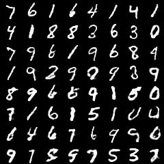
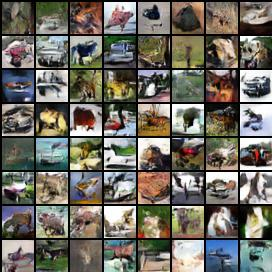
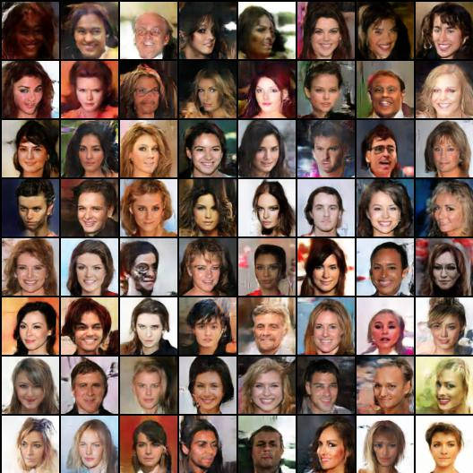

# Implementation for MAGAN: Margin Adaptation for Adversarial Networks

Tensorflow implementation of [MAGAN: Margin Adaptation for Generative Adversarial Networks](https://arxiv.org/abs/1704.03817).

## Requirements

- Python 2.7
- [Pillow](https://pillow.readthedocs.io/en/4.0.x/)
- [TensorFlow 1.0.1](https://github.com/tensorflow/tensorflow)
- [PrettyTensor](https://github.com/google/prettytensor)

## Usage

First download [CelebA](http://mmlab.ie.cuhk.edu.hk/projects/CelebA.html) dataset at [link](https://drive.google.com/open?id=0B7EVK8r0v71pZjFTYXZWM3FlRnM).  
and/or 
[CIFAR-10](https://www.cs.toronto.edu/~kriz/cifar.html) (python version) at [link](https://www.cs.toronto.edu/~kriz/cifar-10-python.tar.gz):

To train a model:

    $ python gan_release.py [cifar/celebA] {dataset_dir}
	$ python gan_release.py mnist #data_dir not needed for mnist 

## Results

### Generator output on MNIST, CIFAR-10, and CelebA

MNIST output

CIFAR-10 output

CelebA output

## Author
[Ruohan Wang](http://www.imperial.ac.uk/personal-robotics/people/ruohan/)

